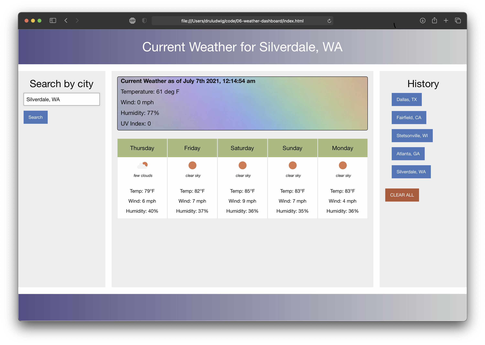

# Weather Dashboard v0.9

 Open App: https://druludwig.github.io/06-weather-dashboard/

## Highlights
- We were told to try new frameworks. This project uses Foundationby ZURB instead of Bootstrap.
- The app uses 2 APIs: Mapquest to geocode the city and Openweather to request weather data.
- A clear button removes user history.
- For this project, I focused on new API content and not so much on minimizing code.

## Notes
This app contains a bug that - after many hours - I simply accepted into my life. The buttons in the history list are only listened to upon page load. If the user searches for a city, the history buttons cease to cooperate.

## Screenshot
